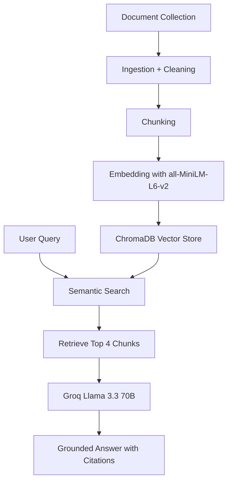

# Project 1 Planning: The Unofficial Guide

> Write this document before you write any pipeline code.
> Your spec and architecture diagram are what you'll use to direct AI tools to generate your implementation.
> Update the Retrieval Approach and Chunking Strategy sections if you change your approach during implementation.
> Update this file before starting any stretch features.

---

## Domain

My domain is Livingstone College student survival knowledge. The system will help students ask questions about professors, dining, housing, campus life, student resources, and general student experiences.

This knowledge is valuable because students often need practical advice that is not fully explained in official college pages. The information is spread across student reviews, Reddit comments, professor reviews, dining pages, housing pages, and official student resources, so a RAG system can make it easier to search and compare.

---

## Documents

| #   | Source                                     | Description                                                                                         | URL or location                                                     |
| --- | ------------------------------------------ | --------------------------------------------------------------------------------------------------- | ------------------------------------------------------------------- |
| 1   | Rate My Professors - Livingstone College   | Student ratings and school-level reviews                                                            | https://www.ratemyprofessors.com/school/5306                        |
| 2   | Rate My Professors - Professor Search      | Professor review pages for Livingstone faculty                                                      | https://www.ratemyprofessors.com/search/professors/5306?q=*         |
| 3   | Niche - Livingstone College Overview       | Student review summaries, campus experience, overall ratings                                        | https://www.niche.com/colleges/livingstone-college/                 |
| 4   | Niche - Livingstone Reviews                | Individual student reviews about campus life, classes, services, and facilities                     | https://www.niche.com/colleges/livingstone-college/reviews/         |
| 5   | Niche - Campus Life                        | Student opinions about housing, food, athletics, and clubs                                          | https://www.niche.com/colleges/livingstone-college/campus-life/     |
| 6   | Appily - Livingstone Reviews               | Student comments about academics, professors, and campus environment                                | https://www.appily.com/colleges/livingstone-college/reviews         |
| 7   | Reddit r/HBCU - Livingstone College Thread | Informal student advice about dorms, financial aid, and campus survival tips                        | https://www.reddit.com/r/HBCU/comments/1mipw1z/livingstone_college/ |
| 8   | Livingstone Student Affairs                | Official student support services, student handbook links, counseling, health, and campus resources | https://livingstone.edu/students/                                   |
| 9   | Livingstone Residence Life                 | Housing information, residence life expectations, and student living policies                       | https://livingstone.edu/students/residence-life/                    |
| 10  | Livingstone Campus Life                    | Official campus life information and student activity resources                                     | https://livingstone.edu/campus-life/                                |
| 11  | LuxeLife Dining Meal Plans                 | Meal plan options, dining rules, commuter plans, and dining FAQs                                    | https://www.luxelifedining.com/livingstone-mealplans                |
| 12  | LuxeLife Dining Menus                      | Campus dining menu information                                                                      | https://www.luxelifedining.com/livingstone-menu                     |

---

## Chunking Strategy

**Chunk size:**  
About 350-500 words per chunk.

**Overlap:**  
About 75 words of overlap.

**Reasoning:**  
My documents include short student reviews, Reddit comments, professor reviews, official student pages, and longer policy-style content. A 350-500 word chunk is large enough to preserve context but small enough to keep each chunk focused on one topic. The 75-word overlap helps prevent important information from being split across chunk boundaries, especially in longer pages like Student Affairs, Residence Life, and dining FAQs.

---

## Retrieval Approach

**Embedding model:**  
`sentence-transformers/all-MiniLM-L6-v2`

**Top-k:**  
Retrieve the top 4 chunks per query.

**Production tradeoff reflection:**  
For this project, I am using `all-MiniLM-L6-v2` because it is free, fast, and runs locally without an API key. In a production system, I would compare it with stronger embedding models based on accuracy, context length, cost, latency, multilingual support, and performance on student-review language. I would also consider whether the system should run fully locally or use an API-based embedding model for better retrieval quality.

---

## Evaluation Plan

| #   | Question                                                                    | Expected answer                                                                                                                                                                                                     |
| --- | --------------------------------------------------------------------------- | ------------------------------------------------------------------------------------------------------------------------------------------------------------------------------------------------------------------- |
| 1   | What do students say are the main strengths of Livingstone College?         | Students commonly describe Livingstone as close-knit, supportive, family-like, and full of HBCU pride. Some reviews mention helpful professors, student growth, and opportunities to get involved.                  |
| 2   | What are common complaints students mention about Livingstone College?      | Common complaints include organization issues, housing or dorm concerns, dining variety, communication problems, transportation, and outdated facilities.                                                           |
| 3   | What should a new student know before coming to Livingstone?                | Students should stay organized, follow up with offices like financial aid or housing, keep copies of important documents, get involved socially, and be prepared to advocate for themselves.                        |
| 4   | What dining or meal plan information is available for Livingstone students? | The dining source mentions meal plan options, commuter plans, dining hall use, bonus points, and rules about unused meals and refunds.                                                                              |
| 5   | What does Residence Life say about living on campus?                        | Residence Life says housing is meant to support student development, maturity, self-respect, academic progress, and social dignity. Students must complete housing requirements and follow residence hall policies. |

---

## Anticipated Challenges

1. Some student-generated sources may be noisy, opinion-based, outdated, or inconsistent. This could make retrieval difficult because different students may describe the same issue in different ways.

2. Some official sources may not fully answer “real student experience” questions. The system may retrieve official policy text when the user really wants informal student advice.

3. Some websites may have limited text extraction or may block easy scraping. If that happens, I may need to manually save relevant text into local `.txt` files.

4. The system may confuse similar topics, such as dining policies versus student opinions about food quality.

---

## Architecture

---

## AI Tool Plan

**Milestone 3 — Ingestion and chunking:**  
I will use ChatGPT to help write the ingestion and chunking code. I will give it my document list, chunk size, overlap size, and file structure. I expect it to produce Python functions that load documents, clean text, and split text into chunks. I will verify the output by checking that each chunk has source metadata and that chunks are not too short or too long.

**Milestone 4 — Embedding and retrieval:**  
I will use ChatGPT to help implement the embedding and vector store pipeline using `sentence-transformers` and ChromaDB. I will give it my Retrieval Approach section and ask for code that embeds chunks, stores them with metadata, and retrieves the top 4 chunks for a query. I will verify it by running test queries before adding generation.

**Milestone 5 — Generation and interface:**  
I will use ChatGPT to help build a simple Streamlit or command-line interface. I will give it the requirement that answers must only use retrieved chunks and must include source attribution. I will verify it by asking my 5 evaluation questions and checking whether the answers are grounded in the retrieved sources.
